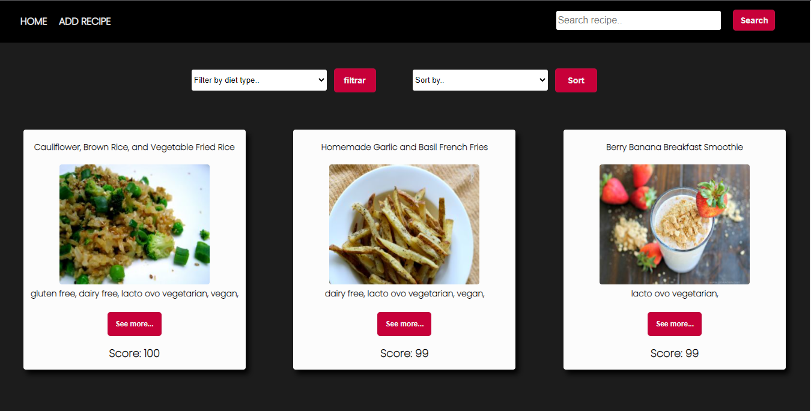

<div align = 'center'></div>
<h1 align="center"> Hola, Mi nombre es Daniel! 👋 :computer: </h1>

```js
const DaniCancino = {
  Skills: {
      BackEnd: [
          {JavaScript: ['NodeJs', 'Express', 'Sequelize']},
        ],
      FrontEnd: [
          {JavaScript: ['React', 'React-Native', 'Redux']}
        ]
    },
  Proyects: [
      RecipesApp: ['Reacte', 'Redux', 'NodeJs', 'Express', 'Sequelize']},
    ],
  FutureTecnologies: ['Firebase', 'TypeScript', 'Socket.io'],
}
```
<div>
  <p>
    Soy un Full Stack Developer que le gustan los desafios, me gustan mucho los algoritmos, soy una persona con mucha energia y ganas de adquirir muchos conocimientos.
    Actualmente estoy realizando proyectos propios para aumentar mis conocimientos y poder afrontar nuevos desafios. Me gusta la musica y la tecnología.
  </p>
</div>
&nbsp;

## :pushpin: Mis proyectos
<h3>Recipes App</h3>
<div>
  <a></a>
  <a></a>
  <a></a>
  <a></a>
</div> 
&nbsp;

## :paperclip: Me puedes contactar en:

<div>
    <a href="https://www.linkedin.com/in/danicancino-dev/">
      
    </a>
  <a href="mailto:zieteweb@gmail.com" >
    
  </a>
    <a href="https://twitter.com/ziete_77">
      
    </a>
    <a href="https://github.com/DaniCancino">
      
    </a>
</div>


